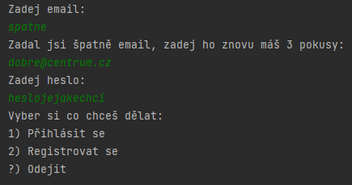

# HelpDesk

## Zadání práce

Program slouží pro zaslání požadavku na support, uživatel se přihlásí do aplikace svými údaji od gmail účtu a poté bude moct posílat nové tickety a sledovat stav těch starých, program si ukládá všechny uživatele do souboru, pro přihlášení po restartování programu. Všechny nové tickety se automaticky zašlou na email helpdesk admina a uživateli se pošle potvrzovací mail.

## Návrh řešení

### Funkční specifikace

Menu v aplikaci je vybírání z číselného seznamu. Po spuštění je uživateli vypsán seznam, zda se chce zaregistrovat nebo přihlásit; program si pamatuje, všechny zaregistrované uživatele. Po přihlášení si uživatel může vybrat, zda se chce odhlásit, udělat nový ticket, smazat ticket nebo vypsat seznam ticketů.

`?` jakýkoli jiný znak než je v nabídce menu
* `1` – Přihlásit se
* `2` – Registrovat se
* `?` – Ukončit aplikaci
* Po přihlášení:
  * `?` Odhlásit se
  * `1` Nový ticket
  * `2` Seznam ticketů
    * `0-n` Ticket, který se má otevřít
    * `s` seřadí podle názvu
    * `r` seřadí podle času vytvoření
    * `?` zpět
  * `3` Smazat ticket

### Struktura vstupních a výstupních souborů

* do souboru users.txt se ukládají všichni uživatelé s jejich daty, tím pádem se tam ukládají i tickety
### Class diagram


## Externí knihovna

* [javax.mail](https://javaee.github.io/javamail/)

### Příklady použití

```java
public class MailSender {
    private String from = "sefrhelpdeskjava@gmail.com";
    private final String host = "smtp.gmail.com";
    Properties properties;
    TimeDate td = new TimeDate();
    public MailSender() {
        properties = System.getProperties();

        // Setup mail server
        properties.put("mail.smtp.host", host);
        properties.put("mail.smtp.port", "465");
        properties.put("mail.smtp.ssl.enable", "true");
        properties.put("mail.smtp.auth", "true");
    }
    public void Send(String _from, String _password, String _to, String _subject, String _message){
        Session session = Session.getInstance(properties, new javax.mail.Authenticator() {

            protected PasswordAuthentication getPasswordAuthentication() {

                return new PasswordAuthentication(_from, _password);

            }

        });

        // Used to debug SMTP issues
        session.setDebug(true);
        try {
            // Create a default MimeMessage object.
            MimeMessage message = new MimeMessage(session);

            // Set From: header field of the header.
            message.setFrom(new InternetAddress(_from));

            // Set To: header field of the header.
            message.addRecipient(Message.RecipientType.TO, new InternetAddress(_to));

            // Set Subject: header field
            message.setSubject(_subject);
            StringBuilder string = new StringBuilder();
            string.append(_message);
            string.append("\n");
            string.append(td.getTime());
            // Now set the actual message
            message.setText(string.toString());

            System.out.println("sending...");
            // Send message
            Transport.send(message);
            System.out.println("Sent message successfully....");
            Reply(_from, _subject);
        } catch (MessagingException mex) {
            mex.printStackTrace();
        }

    }
```
# Struktura vstupních a výstupních souborů


Kus zápisu ze souboru, kam si uživatel může uložit všechny své tickety.


Kus zápisu ze souboru, kam se ukládají všechna data o registracích a ticketech (databáze)

# Testy

## 1) Přihlášení


## 2) Registrace, špatný formát emailu


## 3) Posílání ticketu


## 4) výpis ticketu


## 5) výpis ticketů


## 6) odebrání ticketu


## 7) řazení ticketů abecedně


## 8) řazení podle času


## 9) Odhlášení se


## 10) vypnutí programu
